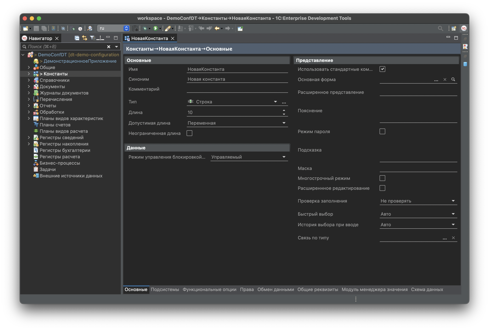
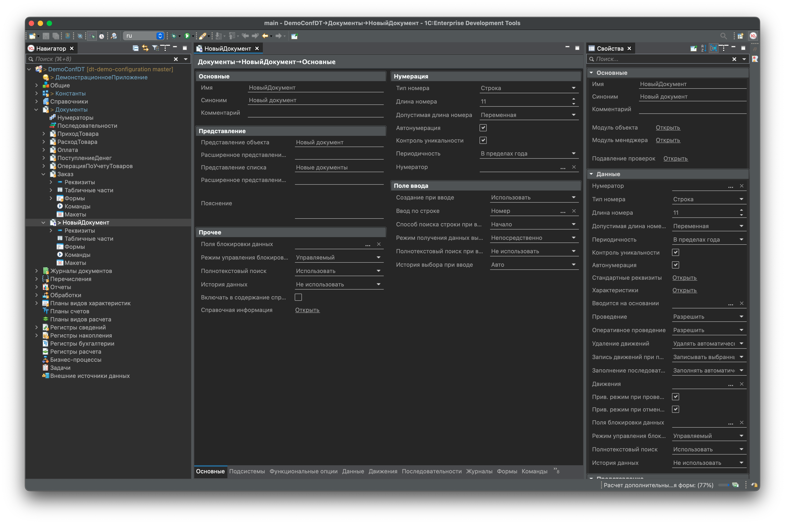
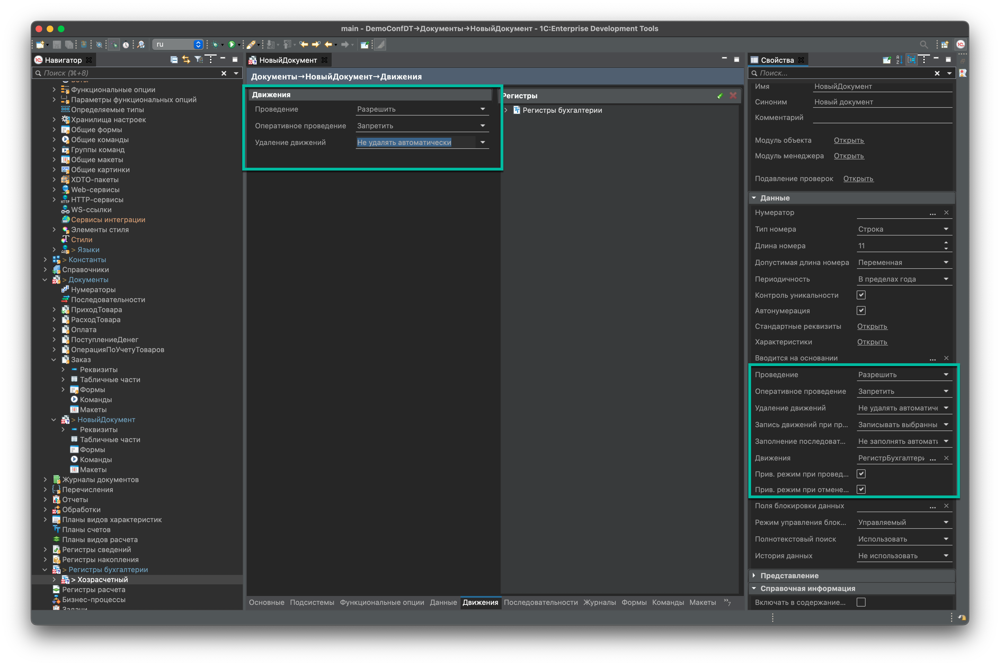

# Шаблоны новых объектов 1С для 1С:Бухгалтерия предприятия


Используется для создания новых объектов в конфигурации, чтобы не забыть, что нужно сделать.
Сделано на примере 1С:Бухгалтерия предприятия, в других конфигурациях могут быть другие, а могут быть и похожие объекты.

Репозиторий входит в ТОП - [](https://openyellow.notion.site/openyellow/24727888daa641af95514b46bee4d6f2?p=a1ea69ead78646a3be12d9ad19233a5f&amp;pm=s)

- [Шаблоны новых объектов 1С для 1С:Бухгалтерия предприятия](#шаблоны-новых-объектов-1с-для-1сбухгалтерия-предприятия)
- [Константы](#константы)
- [Документы](#документы)
  - [Основные свойства](#основные-свойства)
  - [Нумерация](#нумерация)
  - [Проведение документа (Движения)](#проведение-документа-движения)
  - [Реквизиты документа](#реквизиты-документа)
  - [Подразделение организации](#подразделение-организации)
  - [Контрагент](#контрагент)
  - [Договоры контрагентов](#договоры-контрагентов)
  - [Ручная корректировка движений](#ручная-корректировка-движений)
  - [Функциональные опции](#функциональные-опции)
  - [Показ движений документа](#показ-движений-документа)
  - [Структура подчиненности (Связанные документы)](#структура-подчиненности-связанные-документы)
  - [Роли](#роли)
  - [Планы обмена (Работа в распределенной базе - РИБ)](#планы-обмена-работа-в-распределенной-базе---риб)
  - [Печать](#печать)
  - [Дополнительные отчеты и обработки](#дополнительные-отчеты-и-обработки)
  - [Журналы документов](#журналы-документов)
  - [Данные первичных документов](#данные-первичных-документов)
  - [Дата запрета изменения](#дата-запрета-изменения)
  - [Модуль объекта](#модуль-объекта)
  - [Форма списка и Форма выбора](#форма-списка-и-форма-выбора)
  - [Форма документа](#форма-документа)
  - [Дополнительные сведения](#дополнительные-сведения)
  - [Версионирование](#версионирование)
  - [Присоединенные файлы](#присоединенные-файлы)
- [Справочники](#справочники)
  - [Основные свойства](#основные-свойства-1)
  - [Нумерация](#нумерация-1)
  - [Функциональные опции](#функциональные-опции-1)
  - [Подразделение организации](#подразделение-организации-1)
  - [Роли](#роли-1)
  - [Печать](#печать-1)
  - [Работа в распределенной базе (РИБ)](#работа-в-распределенной-базе-риб)
  - [Версионирование](#версионирование-1)
  - [Отображение помеченных на удаление объектов](#отображение-помеченных-на-удаление-объектов)
- [Регистры сведений](#регистры-сведений)
  - [Основные свойства](#основные-свойства-2)
  - [Подразделение организации](#подразделение-организации-2)
  - [Командный интерфейс](#командный-интерфейс)
  - [Функциональные опции](#функциональные-опции-2)
  - [Роли](#роли-2)
  - [Дата запрета изменения](#дата-запрета-изменения-1)
  - [Работа в распределенной базе (РИБ)](#работа-в-распределенной-базе-риб-1)
- [Регистры накопления](#регистры-накопления)
  - [Основные свойства](#основные-свойства-3)
  - [Роли](#роли-3)
  - [Дата запрета изменения](#дата-запрета-изменения-2)
  - [Работа в распределенной базе (РИБ)](#работа-в-распределенной-базе-риб-2)
- [Ссылка на Инфостарт](#ссылка-на-инфостарт)
- [Благодарность](#благодарность)

# Константы

1. Новую константу следует включить в план обмена "[МиграцияПриложений](https://its.1c.ru/db/smtl/content/22218931/hdoc)", при этом авторегистрация должна быть выключена.

2. Для работы в распределенной информационной базе константу следует включить в соответствующие подписки и планы обменов. Названия обычно заканчиваются на "РегистрацияКонстанты", например, АвтономнаяРаботаРегистрацияКонстанты.

    Константы:

- **АвтономнаяРаботаРегистрацияКонстанты**
- **ПолныйРегистрацияКонстанты**
- **ПоОрганизацииРегистрацияКонстанты**

    Планы Обменов:

- **АвтономнаяРабота**
- **Полный**
- **ПоОрганизации**



[↑ Наверх](#константы)

# Документы

## Основные свойства

1. **Имя**. Имя дается в единственном числе, например ЗаказПокупателя, ПеремещениеТоваров, Анкета.

<details>
<summary>Подробнее в стандарте Имена объектов метаданных в конфигурациях</summary>

Ссылка на стандарт - [Имена объектов метаданных в конфигурациях](https://its.1c.ru/db/v8std/content/550/hdoc)

Имена документов, напротив, даются в единственном числе. Например: ЗаказПокупателя, ПеремещениеТоваров, Анкета.

При этом следует избегать в именах документов слов, от удаления которых смысл не меняется, например: «Документ…».

При выборе имени документа следует различать два случая:

1. В первую очередь, следует стараться отразить в имени документа суть процесса, который отражается в системе этим документом. При этом само имя должно быть максимально лаконичным, рекомендуется избегать слов «Накладная…», «Акт…» и т.п.

Например, в системе автоматизирован процесс «Сверка взаиморасчетов», который завершается подписанием сторонами, участвующими в сверке, печатного документа «Акт сверки  товаров».  Поскольку в данном случае в системе документом фиксируется именно процесс, то документ называется СверкаВзаиморасчетов.

2. Если документ не отражает какой-либо процесс в системе, а предназначен только для получения соответствующей печатной формы, то допустимо образовывать имя документа от имени печатной формы. В этом случае допустимо использовать слова «Накладная», «Акт» и т.п. в имени документа. Как правило, у такого документа нет статусов, по нему не вводятся на основании другие документы, а сам процесс получения печатной формы может быть автоматизирован другими документами.

Например, для получения печатной формы «Товарно транспортная накладная» (ТТН) в системе имеется документ, который содержит реквизиты, специфичные для данного печатного документа. При этом поскольку весь процесс формирования ТТН связан с другими документами («Реализация  товаров и  услуг», «Перемещение товаров»), то документ целесообразно назвать от имени печатной формы: ТоварноТранспортнаяНакладная.
</details>

2. **Синоним**. Синоним объекта должен быть определен так, чтобы осмысленно, лаконично описывать объект. Заполняется обязательно

<details>
<summary>Подробнее в стандарте Имя, синоним, комментарий</summary>

Ссылка на стандарт - [Имя, синоним, комментарий](https://its.1c.ru/db/v8std/content/474/hdoc)

1.1. Синоним объекта должен быть определен так, чтобы осмысленно, лаконично описывать объект. Заполняется обязательно.

Данное требование продиктовано тем, что синонимы непосредственно участвуют в формировании пользовательского интерфейса (отображаются в формах, отчетах, командном интерфейсе и т.д.) и поэтому должны корректно и одинаково во всех местах пользовательского интерфейса идентифицировать ту сущность, к которой они относятся. Помимо объектов метаданных, требование распостраняется также и на реквизиты объектов метаданных, табличные части, реквизиты табличных частей, измерения регистров, ресурсы и другие объекты конфигурации, у которых имеется синоним.

1.2. Не рекомендуется в синонимах объектов использовать сокращения. Исключением являются только общеупотребительные и соответствующие целевой аудитории сокращения (например, Сумма (регл.) ) и аббревиатуры (например, НДС или МСФО).
</details>

3. **Комментарий**. Не заполняется

4. **Представление объекта**. Заполняется в единственном числе, например, Заказ покупателя или Реализация услуг. Представления объекта не задается, если совпадает с синонимом. Слова типа «Поступление», «Реализация», «Инвентаризация» используются без изменения и для объекта, и для списка

5. **Представление списка**. Заполняется во множественном числе, например, Заказы покупателя. Представления списка не задается, если совпадает с синонимом. Слова типа «Поступление», «Реализация», «Инвентаризация» используются без изменения и для объекта, и для списка

Длина свойства, которое отображается в командном интерфейсе (Представление списка или синоним) должна быть не более 38 символов. Идеально, если они уместятся в 30 символов

[↑ Наверх](#документы)

## Нумерация

1. Для установки нумерации необходимо установить свойства документа:

- **Тип номера** - Строка
- **Длина номера** - 11
- **Допустимая длина номера** - Переменная
- **Периодичность** - В пределах года
- **Контроль уникальности** - Да
- **Автонумерация** - Да

2. Для установки номера документ нужно включить в один из наборов подписок, например для Бухгалтерии предприятия:

- Если у документа есть реквизиты **Организация** и **ПодразделениеОрганизация**, то включить в подписки:

  - **ПередЗаписьюДокументаПроверкаНомераПоДатеОрганизацииПодразделению**
  - **УстановитьПрефиксИнформационнойБазыОрганизацииПодразделенияНомеруДокумента**

- Если у документа есть реквизит **Организация**, но нет реквизита **ПодразделениеОрганизации**, то включить в подписки:
  
  - **ПередЗаписьюДокументаПроверкаНомераПоДатеИОрганизации**
  - **УстановитьПрефиксИнформационнойБазыИОрганизацииНомеруДокумента**

- Если у документа нет реквизита **Организация**, то включить в подписки:
  
  - **ПередЗаписьюДокументаПроверкаНомераПоДате**
  - **УстановитьПрефиксИнформационнойБазыНомеруДокумента**



[↑ Наверх](#документы)

## Проведение документа (Движения)

1. Необходимо установить свойства документа:

- **Проведение** - Разрешить, если документ формирует движения
- **Оперативное проведение** - Запретить
- **Удаление движений** - Не удалять автоматически
- **Запись движений при проведении** - Записывать выбранные
- **Заполнение последовательностей** - Не заполнять автометически
- **Привилегированный режим при проведении** - Да
- **Привилегированный режим при отмене проведении** - Да

2. Документы, движения которых не удаляются автоматически, следует включить в подписку **ПередЗаписьюДокументаДляУдаленияДвижений**

3. Документы, которые при формировании движений обращаются к данным других документов или регистров, следует включить в последовательность **ДокументыОрганизации**, а также в подписки:

- **ЗарегистрироватьВПоследовательностиПередУдалением**
- **ЗарегистрироватьВПоследовательностиПриЗаписи**
- **ОтменитьРегистрациюПриОбменеПередЗаписью**

4. Для подготовки движений следует разделять методы подготовки данных и заполнение коллекции Движения. Код подготовки данных следует размещать в модуле менеджера, код заполнения в коллекции Движения - в модуле менеджера или общем модуле.
Перед кодом заполнения коллекции Движения следует вызвать:
    ```
    ПроведениеСервер.ПодготовитьНаборыЗаписейКПроведению(ЭтотОбъект);
    ```

    После

    ```
    ПроведениеСервер.УстановитьЗаписьОчищаемыхНаборовЗаписей(ЭтотОбъект);
    ```

5. Для удаления движений следует добавить обработчик в модуле объекта документа **ОбработчикУдаленияПроведения** с кодом:

    ```
    Процедура ОбработкаУдаленияПроведения(Отказ)
       ПроведениеСервер.ПодготовитьНаборыЗаписейКОтменеПроведения(ЭтотОбъект);
       Движения.Записать();  
       РаботаСПоследовательностями.ОтменитьРегистрациюВПоследовательности(ЭтотОбъект, Отказ); 
    КонецПроцедуры
    ```

6. Документ, который формируют движения следует включить в подписку **ПроверитьКорректностьДаты**

    Подписка запрещает запись документов с датой ранее 2000 или позднее 2030 года.



[↑ Наверх](#документы)

## Реквизиты документа

1. **Значение заполнения**. Заполняется значением по умолчанию, например, Курс = 1 или ВидОперации = Основной вид операции
2. **Заполнять из данных заполнения**. **Да**, если требуется заполнить реквизит при создании нового документа из формы списка с установленными отборами
3. **Проверка заполнения**. **Выдавать ошибку**, если хотя бы в одном сценарии требуется обязательное заполнение реквизита.

<details>
<summary>Подробнее в стандарте Подсказка и проверка заполнения</summary>

Ссылка на стандарт - [Подсказка и проверка заполнения](https://its.1c.ru/db/v8std/content/478/hdoc)
2.1. Свойство «Проверка заполнения». Для всех типизированных объектов метаданных, а также для стандартных реквизитов и табличных частей, которые в соответствии с логикой объекта являются обязательными к заполнению, свойство "Проверка заполнения" должно быть установлено в "Выдавать ошибку".

В ряде случаев проведение документа с незаполненными реквизитами и табличными частями не имеет смысла с точки зрения отражения документа в учете. Например, документ Заказ клиента является запросом клиента на поставку определенного количества товара. Из определения понятно, что методически заказ с незаполненным клиентом и незаполненной табличной частью Товары не имеет смысла, поэтому у реквизита Клиент и табличной части Товары свойство "Проверка заполнения" должно быть установлено в "Выдавать ошибку".

2.2. При установке свойства «Проверка заполнения» следует исходить из того, что все ограничения и проверки должны быть (насколько это возможно полно) описаны в метаданных конфигурации. Поэтому если хотя бы один из сценариев работы с объектом требует обязательного заполнения реквизита, то свойство «Проверка заполнения» устанавливается в «Выдавать ошибку». Если в других сценариях работы заполнять реквизит не обязательно, то такие случаи должны быть предусмотрены в [обработчике события модуля объекта ОбработкаПроверкиЗаполнения](https://its.1c.ru/db/v8std#content:463:hdoc).

При этом не следует придерживаться обратной схемы, когда свойство «Проверка заполнения» установлено в «Не проверять», а в обработчике ОбработкаПроверкиЗаполнения дописаны какие-либо проверки заполнения. Такая схема затрудняет анализ логики работы конфигурации.

2.3. Если проверка заполнения реквизита зависит от тех или иных условий, рекомендуется управлять автопометкой незаполненного значения с помощью условного оформления форм объектов. Убирать ее в случае, если при данном состоянии объекта заполнение реквизита проверять не требуется.

</details>

4. **Связи параметров выбора**. Заполняется, если значение реквизита зависит от значений других реквизитов документа, например: для ДоговорКонтрагента задаются связи: Отбор.Владелец(Контрагент), Отбор.Организация(Организация)

5. **Параметры выбора**. Заполняется, если значение ограничено заранее известными условиями отбора, например, если ДоговорКонтрагента можно выбрать только вида СПоставщиком – вид договора задается в параметрах выбора.
Для счетов учета устанавливается Отбор.ЗапретитьИспользоватьВПроводках(Ложь)

[↑ Наверх](#документы)

## Подразделение организации

Если в документе есть реквизит ПодразделениеОрганизации, который используется только в версии КОРП, то документ следует включить в подписку **УстановитьПустоеПодразделениеПередЗаписьюДокумента**

[↑ Наверх](#документы)

## Контрагент

Если в документе есть реквизит **Контрагент**, то следует:

1. Если в документе можно добавлять новых контрагентов, то следует добавить обработчики событий **АвтоПодбор**, **ОкончаниеВводаТекста**, **Создание**, **ОбработкаВыбора** со следующим кодом:
    - Если при создании контрагента не используется Банк и НомерСчета (основной сценарий), то:

    ```
    &НаКлиенте
    Процедура КонтрагентАвтоПодбор(Элемент, Текст, ДанныеВыбора, ПараметрыПолученияДанных, Ожидание, СтандартнаяОбработка)
        РаботаСКонтрагентамиБПКлиент.КонтрагентАвтоПодбор(Элемент, Текст, ДанныеВыбора, ПараметрыПолученияДанных, Ожидание, СтандартнаяОбработка);
    КонецПроцедуры

    &НаКлиенте
    Процедура КонтрагентОкончаниеВводаТекста(Элемент, Текст, ДанныеВыбора, ПараметрыПолученияДанных, СтандартнаяОбработка)
        РаботаСКонтрагентамиБПКлиент.КонтрагентОкончаниеВводаТекста(Элемент, Текст, ДанныеВыбора, ПараметрыПолученияДанных, СтандартнаяОбработка);
    КонецПроцедуры

    &НаКлиенте
    Процедура КонтрагентОбработкаВыбора(Элемент, ВыбранноеЗначение, СтандартнаяОбработка)
        РаботаСКонтрагентамиБПКлиент.КонтрагентОбработкаВыбора(Элемент, ВыбранноеЗначение, СтандартнаяОбработка);
    КонецПроцедуры
    
    &НаКлиенте
    Процедура КонтрагентСоздание(Элемент, СтандартнаяОбработка)
        РаботаСКонтрагентамиБПКлиент.КонтрагентСоздание(Элемент, Элемент.ТекстРедактирования, СтандартнаяОбработка);
    КонецПроцедуры
    ```

    - Если при создании контрагента требуется еще указать Банк и НомерСчета, то:

    ```
    &НаКлиенте
    Процедура КонтрагентАвтоПодбор(Элемент, Текст, ДанныеВыбора, ПараметрыПолученияДанных, Ожидание, СтандартнаяОбработка)
        РаботаСКонтрагентамиБПКлиент.КонтрагентАвтоПодбор(Элемент, Текст, ДанныеВыбора, ПараметрыПолученияДанных, Ожидание, СтандартнаяОбработка);
    КонецПроцедуры

    &НаКлиенте
    Процедура КонтрагентОкончаниеВводаТекста(Элемент, Текст, ДанныеВыбора, ПараметрыПолученияДанных, СтандартнаяОбработка)
        РаботаСКонтрагентамиБПКлиент.КонтрагентОкончаниеВводаТекста(Элемент, Текст, ДанныеВыбора, ПараметрыПолученияДанных, СтандартнаяОбработка);
    КонецПроцедуры

    &НаКлиенте
    Процедура КонтрагентОбработкаВыбора(Элемент, ВыбранноеЗначение, СтандартнаяОбработка)
        РаботаСКонтрагентамиБПКлиент.КонтрагентОбработкаВыбора(Элемент, ВыбранноеЗначение, СтандартнаяОбработка, ,Истина);
    КонецПроцедуры
    
    &НаКлиенте
    Процедура КонтрагентСоздание(Элемент, СтандартнаяОбработка)
        РаботаСКонтрагентамиБПКлиент.КонтрагентСоздание(Элемент, Элемент.ТекстРедактирования, СтандартнаяОбработка, ,Истина);
    КонецПроцедуры

2. Для показа документа в списке документов по контрагенту (открывается из панели навигации формы контрагента по ссылке **Документы**) реквизиты документа с типом **Справочник.Контрагенты** необходимо включить в критерий отбора **ДокументыПоКонтрагенту**

[↑ Наверх](#документы)

## Договоры контрагентов

Если в документе есть реквизит **ДоговорКонтрагента**, то следует:

1. Добавить этот документ в **РаботаСДоговорамиКонтрагентовБП.ВидДоговораПоОбъекту**
2. Добавить реквизит "Договор контрагента" в состав функциональной опции - **ВестиУчетПоДоговорам**
3. Добавить код в модуль объекта в событии ПередЗаписью ```РаботаСДоговорамиКонтрагентовБП.ЗаполнитьДоговорПередЗаписью(ЭтотОбъект);```
4. Для показа документа в списке документов по договору контрагента (открывается из панели навигации формы договора по ссылке **Документы**) реквизиты документа с типом **Справочник.ДоговорыКонтрагентов** необходимо включить в критерий отбора **ДокументыПоДоговоруКонтрагента**

[↑ Наверх](#документы)

## Ручная корректировка движений

Для использования ручной корректировки движений требуется:

1. Добавить реквизит документа **РучнаяКорректировка** с типом **Булево**
2. Документ включить в подписку на событие **ПриКопированииДокументаСВозможностьюРучногоРедактирования**
3. В **ОбработкаПроведения** документа после вызова кода

```
ПроведениеСервер.ПодготовитьНаборыЗаписейКПроведению(ЭтотОбъект);
```

следует разместить код

```
Если РучнаяКорректировка Тогда
    Возврат;
КонецЕсли;
```

[↑ Наверх](#документы)

## Функциональные опции

Функциональные опции используются как для скрытия всего документа, так и конкретных реквизитов.

1. Если документ не принадлежит основной функциональности (доступен всем пользователям), то его необходимо включить в состав функциональной опции. 

    Возможно придется добавить ее в **Обработка.ФункциональностьПрограммы** по аналогии с другими опциями.

2. Если используются реквизиты из списка ниже, то их следует включить в состав функциональных опций:

| Реквизиты | Функциональные опции |
|-----------|--------------------|
| Организация | ИспользоватьНесколькоОрганизацийБухгалтерскийУчет |
| ПодразделениеОрганизации | ВестиУчетПоПодразделениям |
| Склад | ИспользоватьНесколькоСкладовБухгалтерскийУчет |
| ВалютаДокумента, КурсВзаиморасчетов, КратностьВзаиморасчетов | ИспользоватьВалютныйУчет |
| БанковскийСчетОрганизации | ИспользоватьНесколькоБанковскихСчетовОрганизации |
| Ответственный | ИспользоватьНесколькоОтветственных |
| РучнаяКорректировка | ИспользоватьРучнуюКорректировкуДвижений |
| Патент, ДеятельностьНаПатенте | ПрименяетсяУСНПатент |
| СуммаНУ | ПлательщикНалогаНаПрибыль |

3. Параметризуемые функциональные опции, например **ПлательщикНалогаНаПрибыль** или **ПрименяетсяУСН** зависят от двух реквизитов **Организация** и **Дата**, поэтому следует
добавить вызов **ОбщегоНазначенияБПКлиентСервер.УстановитьПараметрыФункциональныхОпцийФормыДокумента**:

- в обработчики инициализации реквизитов формы:

  - ПриСозданииНаСервере (при условии Параметры.Ключ.Пустая)
  - ПриЧтенииНаСервере
  - ПослеЗаписиНаСервереЦелесообразно

- в обработчики изменения реквизитов, от которых зависят функциональные опции, например **ПриИзмененииОрганизации**
- в обработчик изменения реквизита **Дата**
    При изменении даты следует обратить внимание на методы выполняемые на сервере контекстно.

    Для таких вызовов следует проверять **ОбщегоНазначенияБПКлиент.ТребуетсяВызовСервераПриИзмененииДатыДокумента**.

    При этом реквизит формы, передаваемый в параметр **ПредыдущаяДата** метода следует называть **ТекущаяДатаДокумента** (потому что это дата, которой соответствуют остальные свойства формы)

    **Важно:** метод не меняет значение этого реквизита формы, это нужно сделать самостоятельно в форме после вызова метода, вне зависимости от возвращенного результата.

```  
    ТребуетсяВызовСервера = ОбщегоНазначенияБПКлиент.ТребуетсяВызовСервераПриИзмененииДатыДокумента(Объект.Дата, ТекущаяДатаДокумента);
    ТекущаяДатаДокумента = Объект.Дата;
    Если Не ТребуетсяВызовСервера Тогда
        Возврат;
    КонецЕсли;
```

[↑ Наверх](#документы)

## Показ движений документа

Для использования типовой команды показа движения по кнопке "ДтКт":

1. Документ необходимо включить в список типов параметра общей команды **ПоказатьДвиженияДокумента**

2. В модуле формы объекта добавить в **ОбработкаОповещения** код:

```
ОбщегоНазначенияБПКлиент.ОбработкаОповещенияФормыДокумента(ЭтотОбъект, Объект.Ссылка, ИмяСобытия, Параметр, Источник);
```

[↑ Наверх](#документы)

## Структура подчиненности (Связанные документы)

1. Для возможности показа структуры подчиненности документ необходимо включить в список типов параметра общей команды **СвязанныеДокументы**
2. Если сам документ может быть выбран в реквизитах других документов – документ необходимо включить в тип критерия отбора **СвязанныеДокументы**
3. Реквизиты документа, содержащие ссылки на другие документы, необходимо включить в состав критерия отбора **СвязанныеДокументы**
    При этом реквизиты документа типа СубконтоN в состав критерия отбора не включаются.

Подробнее в документации БСП: [Структура подчиненности](https://its.1c.ru/db/bsp301doc#content:70:hdoc)

[↑ Наверх](#документы)

## Роли

1. Документ должен быть включен в следующие роли:

    | Роль | Права |
    |------|-------|
    | ДобавлениеИзменениеДанныхБухгалтерии | Все права, кроме: Удаление, Интерактивное удаление |
    | ПолныеПрава | Все права, кроме: Интерактивное удаление |
    | ЧтениеДанныхБухгалтерии | Только права: Чтение, Просмотр, Ввод по строке |

2. RLS - Ограничение на уровне записей
    Для документов нужно дополнительно выполнить следующее:
    - Добавить в процедуру общего модуля **УправлениеДоступомПереопределяемый.ПриЗаполненииСписковСОграничениемДоступа**
    - Добавить в определяемый тип **ВладелецЗначенийКлючейДоступа** ссылку - ДокументСсылка.%ТипОбъекта% 
    - Добавить в определяемый тип **ВладелецЗначенийКлючейДоступаДокумент** объект - ДокументОбъект.%ТипОбъекта% 
    - Добавить в модуль менеджера переопределяемый метод **ПриЗаполненииОграниченияДоступа**, в котором описать правила чтения и изменения для расчетной модели прав. Например,
    ```
    #Область СтандартныеПодсистемы_УправлениеДоступом

    // См. УправлениеДоступомПереопределяемый.ПриЗаполненииСписковСОграничениемДоступа
    //
    Процедура ПриЗаполненииОграниченияДоступа(Ограничение) Экспорт
        Ограничение.Текст =
            "РазрешитьЧтениеИзменение
            |ГДЕ
            | ЗначениеРазрешено(Организация)";
     КонецПроцедуры
    
    #КонецОбласти
    ```

    - В форме документа в процедуру **ПриЧтенииНаСервере** добавить код

    ```
    // СтандартныеПодсистемы.УправлениеДоступом
    Если ОбщегоНазначения.ПодсистемаСуществует("СтандартныеПодсистемы.УправлениеДоступом") Тогда
        МодульУправлениеДоступом = ОбщегоНазначения.ОбщийМодуль("УправлениеДоступом");
        МодульУправлениеДоступом.ПриЧтенииНаСервере(ЭтотОбъект, ТекущийОбъект);
    КонецЕсли;
    // Конец СтандартныеПодсистемы.УправлениеДоступом
    ```
    - Добавить в правах шаблоны RLS:

        - В **ДобавлениеИзменениеДанныхБухгалтерии** следует добавить ограничения для **Чтения**, **Добавление** и **Изменение**
            ```
            #Если &ОграничениеДоступаНаУровнеЗаписейУниверсально #Тогда
            #ДляОбъекта("")
            #Иначе
            #ПоЗначениям("Документ.%ИмяДокумента%",
            "", "","Организации", "Организация",
            "","","","","","","","","","","","","","","","","","","","","","","","","","","","","","")
            #КонецЕсли
            ```
        - В **ЧтениеДанныхБухгалтерии** следует добавить огаринчения для **Чтения** 
            ```
            #Если &ОграничениеДоступаНаУровнеЗаписейУниверсально #Тогда
            #ДляОбъекта("")
            #Иначе
            #ПоЗначениям("Документ.%ИмяДокумента%",
            "", "","Организации", "Организация",
            "","","","","","","","","","","","","","","","","","","","","","","","","","","","","","")
            #КонецЕсли
            ```

3. Атомарные роли, адаптация по работе с неполным набором прав

Сейчас в Бухгалтерии есть профили: **Менеджер по продажам** и **Кладовщик**. Следует подумать нужно ли относить документ к этим профилям или нет.
Для них следует добавить специальные роли **Чтение%ИмяДокумента%** и **ДобавлениеИзменение%ИмяДокумента%**.

4. Стандарты по ограничению прав доступа:

- [Настройка ролей и прав доступа](https://its.1c.ru/db/v8std#content:689:hdoc)
- [Проверка прав доступа](https://its.1c.ru/db/v8std#content:737:hdoc)
- [Безопасность прикладного программного интерфейса сервера](https://its.1c.ru/db/v8std#content:678:hdoc)
- [Использование привилегированного режима](https://its.1c.ru/db/v8std#content:485:hdoc)
- [Использование модулей с повторным использованием возвращаемых значений](https://its.1c.ru/db/v8std#content:724:hdoc)
- [Разработка ролей в библиотеках](https://its.1c.ru/db/v8std#content:668:hdoc)
- [Стандартные роли](https://its.1c.ru/db/v8std#content:488:hdoc)
- [Установка прав для новых объектов и полей объектов](https://its.1c.ru/db/v8std#content:532:hdoc)
- [Ограничения на использование ключевого слова "РАЗРЕШЕННЫЕ" в запросах](https://its.1c.ru/db/v8std#content:415:hdoc)
- [Влияние изменения значений параметров сеанса и функциональных опций на производительность механизма ограничения доступа к данным](https://its.1c.ru/db/v8std#content:491:hdoc)

[↑ Наверх](#документы)

## Планы обмена (Работа в распределенной базе - РИБ)

Документ необходимо включить в состав всех обменов РИБ и в соответствующие подписки на события. При это следует **Запретить** **Авторегистрацию**
| План обмена | Подписки |
|---|---|
| АвтономнаяРабота |  АвтономнаяРаботаРегистрацияДокумента<br>АвтономнаяРаботаРегистрацияУдаления |
| Полный |ПолныйРегистрацияДокумента<br>ПолныйРегистрацияУдаления |
| ПоОрганизации |ПоОрганизацииРегистрацияДокумента<br> ПоОрганизацииРегистрацияУдаления |

[↑ Наверх](#документы)

## Печать

Документы, имеющие печатные формы, следует подключить к механзиму печати БСП:

1. Добавить объект в процедуру **УправлениеПечатьюПереопределяемый.ПриОпределенииОбъектовСКомандамиПечати**.
2. В модуле менеджера добавить процедуру **ДобавитьКомандыПечати**, в ней описать все команды печати.
3. Подключить все формы к подсистеме [Подключаемые команды](https://its.1c.ru/db/bsp302doc/content/54/hdoc).

Подробнее в документации БСП: [https://its.1c.ru/db/bsp301doc\#content:53:hdoc](https://its.1c.ru/db/bsp301doc%23content:53:hdoc)

[↑ Наверх](#документы)

## Дополнительные отчеты и обработки

Документ необходимо включить в состав определяемых типов **ОбъектСДополнительнымиКомандами**

Подробнее в документации БСП: [Дополнительные отчеты и обработки](https://its.1c.ru/db/bsp301doc#content:31:hdoc)

[↑ Наверх](#документы)

## Журналы документов

Новый документ (кроме служебных документов типа **Документ расчетов с контрагентом** или **Партия**) необходимо включить в журнал **ЖурналОпераций**.
В остальные журналы документ включается исходя из раздела учета, к которому документ относится.

[↑ Наверх](#документы)

## Данные первичных документов

Для возможности быстрого получения номера и даты документа в отчетах и печатных формах:

1. Документ необходимо включить в тип измерения **Документ**  **РегистрСведений.ДанныеПервичныхДокументов**.
2. Документ включить в подписку **ЗарегистрироватьДанныеПервичныхДокументов**.

[↑ Наверх](#документы)

## Дата запрета изменения

Для подключения работы Даты запрета изменения следует Документ необходимо :

- Добавить в подписку **ПроверитьДатуЗапретаИзмененияПередЗаписьюДокументаБП**
- Добавить в подписку **ПроверитьДатуЗапретаИзмененияПередУдалениемБП**
- Добавить в процедуру **ДатыЗапретаИзмененияБП.ЗаполнитьИсточникиДанныхДляПроверкиЗапретаИзменения**
- Вставить в модуль формы объекта в процедуру обработчика события **ПриЧтенииНаСервере** вызов ```ДатыЗапретаИзменения.ОбъектПриЧтенииНаСервере(ЭтотОбъект, ТекущийОбъект);```

Подробнее в документации БСП: [Даты запрета изменения](https://its.1c.ru/db/bsp301doc#content:785:hdoc)

[↑ Наверх](#документы)

## Модуль объекта

1. В **ОбработкаЗаполнения** следует поместить вызов ```ЗаполнениеДокументов.Заполнить(ЭтотОбъект, ДанныеЗаполнения);```
2. В **ПриКопировании** следует заменить значения отдельных реквизитов на актуальные, например:

    ```
    Дата = НачалоДня(ОбщегоНазначения.ТекущаяДатаПользователя());
    Ответственный = Пользователи.ТекущийПользователь();
    ```

[↑ Наверх](#документы)

## Форма списка и Форма выбора

1. Чтобы в Простом интерфейсе помеченные на удаление не отображались в списке документов, в **форму списка** и **форму выбора** необходимо:

  - Добавить реквизит формы **ОтслеживатьПометкуУдаления** (Булево).
  - Добавить следующие обработчики (либо дополнить имеющиеся):

    ```
    &НаСервере
    Процедура ПриСозданииНаСервере(Отказ, СтандартнаяОбработка)
        ПомеченныеНаУдалениеСервер.СкрытьПомеченныеНаУдаление(ЭтотОбъект);
    КонецПроцедуры
    
    &НаКлиенте
    Процедура СписокПриИзменении(Элемент)
        ПомеченныеНаУдалениеКлиент.ПриИзмененииСписка(ЭтотОбъект, Элемент);
    КонецПроцедуры
    
    &НаСервере
    Процедура СписокПередЗагрузкойПользовательскихНастроекНаСервере(Элемент, Настройки)
        ПомеченныеНаУдалениеСервер.УдалитьОтборПометкаУдаления(Настройки);
    КонецПроцедуры
    ```

2. В формах списка и выбора документа с ручной корректировкой движений:

    - переопределить текст запроса динамического списка - добавить поле СостояниеДокумента
    ```
    ВЫБОР 
        КОГДА ДанныеСписка.РучнаяКорректировка ТОГДА
            ВЫБОР
                КОГДА ДанныеСписка.ПометкаУдаления ТОГДА 10
                КОГДА НЕ ДанныеСписка.Проведен ТОГДА 9
                ИНАЧЕ 8
            КОНЕЦ
        ИНАЧЕ 
            ВЫБОР
                КОГДА ДанныеСписка.ПометкаУдаления ТОГДА 2
                КОГДА ДанныеСписка.Проведен ТОГДА 1
                ИНАЧЕ 0
            КОНЕЦ
        КОНЕЦ КАК СостояниеДокумента,
    ```
    - указать это поле в свойстве **ПутьКДаннымКартинкиСтроки** таблицы  
    - указать общую картинку в свойстве **КартинкаСтрок**

3. Над списком следует разместить новую пустую группу **ГруппаБыстрыеОтборы** (свойство группы «группировка» – Горизонтальная) и указать ее в свойстве табличного поля.
    Автоматически создаваемую группу с отборами (**СписокКомпоновщикНастроекПользовательскиеНастройки**) следует переименовать в **ГруппаДополнительныеОтборы**.

4. Чтобы корректно работал отбор по основной организации, в настройках динамического списка должен быть добавлен отбор по организации. В обработчиках формы должны быть вызовы:

    ```
    &НаСервере
    Процедура ПриСозданииНаСервере(Отказ, СтандартнаяОбработка)
        ОбщегоНазначенияБПВызовСервера.УстановитьОтборПоОсновнойОрганизации(ЭтотОбъект);
    КонецПроцедуры:
    
    &НаСервере
    Процедура ОбработкаОповещения(ИмяСобытия, Параметр)
        Если ИмяСобытия = "ИзменениеОсновнойОрганизации" Тогда
            ОбщегоНазначенияБПКлиент.ИзменитьОтборПоОсновнойОрганизации(Список, ,Параметр);
        КонецЕсли;
    КонецПроцедуры:
    
    &НаСервере
    Процедура СписокПередЗагрузкойПользовательскихНастроекНаСервере(Элемент, Настройки)
        ОбщегоНазначенияБП.ВосстановитьОтборСписка(Список, Настройки, "Организация");
    КонецПроцедуры
    ```

5. Колонки в списках

    - Для **сумм** или **количества** ширина должна быть указана 10.
    - Заголовок колонки должен полностью помещаться в шапку колонки
    - Колонкам, в которых выводятся бухгалтерские счета следует установить свойство **Растягивать по горизонтали** - **Нет**
    - Дату следует выводить без времени (только дату). Формат колонки **Дата** **ДЛФ=D**, ширина колонки - **7**
    - В заголовках колонок текст нужно выравнивать по содержанию, например, суммы по правому краю.
    - Командную панель следует переделать в группу, чтобы был правильный порядок с группой отборов по организации. См. пример в форме списка **Документ.СчетНаОплату**

[↑ Наверх](#документы)

## Форма документа

1. В форме проводимого документа добавить реквизит **СостояниеДокумента** (Число, 10, 0) и связанное поле картинки (после даты). 
    - Установить для этого поля ВертикальноеПоложениеВГруппе = Центр
    Можно копировать реквизит и поле из ранее созданной формы.
    - Добавить вызов ```ОбщегоНазначенияБП.СостояниеДокумента()``` в обработчики инициализации реквизитов формы. Пример кода ```СостояниеДокумента = СостояниеДокумента(Объект);``` 
        - **ПриСозданииНаСервере** (при условии Параметры.Ключ.Пустая)
        - **ПриЧтенииНаСервере**
        - **ПослеЗаписиНаСервере**:

2. Поле **Комментарий** и **Ответственный** следует размещать **Горизонтально, если возможно**
3. Колонки в табличных частях

    - Для **сумм** или **количества** ширина должна быть указана 10
    - Для **Номер строки** установить ширину 3
    - Заголовок колонки должен полностью помещаться в шапку колонки
    - Колонкам, в которых выводятся бухгалтерские счета следует установить свойство **Растягивать по горизонтали** - **Нет**
    - Дату следует выводить без времени (только дату). Формат колонки **Дата** **ДЛФ=D**, ширина колонки - **7**
    - В заголовках колонок текст нужно выравнивать по содержанию, например, суммы по правому краю.
    - Командную панель следует переделать в группу, чтобы был правильный порядок с группой отборов по организации. См. пример в форме списка **Документ.СчетНаОплату**

[↑ Наверх](#документы)

## Дополнительные сведения

1. Документ включить в определяемый тип **ВладелецДополнительныхСведений**
2. Настроить набор свойств объектов

   - В процедуре **УправлениеСвойствамиПереопределяемый.ПриПолученииПредопределенныхНаборовСвойств** описать предопределенный набор свойств с именем по шаблону Документ_<ИмяОбъекта>, например, Документ_АвансовыйОтчет, а также указать уникальный идентификатор. Здесь можно [получить уникальный идентификатор](https://www.uuidgenerator.net/version4), например:
    ```
    Набор = Наборы.Строки.Добавить();
    Набор.Имя = "Справочник_ВнешниеПользователи"; 
    Набор.Идентификатор = Новый УникальныйИдентификатор("<УникальныйИдентификатор>");
    ```

3. Для объектов, входящих в состав функциональных опций, выполнить требования раздела [Отключение неиспользуемых наборов свойств](https://its.1c.ru/db/bsp318doc#content:4:hdoc:issogl3_отключение_неиспользуемых_наборов_свойств)

4. Настроить характеристики документа по образцу из документации БСП: Подсистема Свойства, раздел [Настройка дополнительных характеристик объектов метаданных](https://its.1c.ru/db/bsp318doc#content:4:hdoc:issogl3_настройка_дополнительных_характеристик_объектов_метаданных)

[↑ Наверх](#документы)

## Версионирование

Документ необходимо включить:

- В состав определяемых типов **ВерсионируемыеДанные**
- В подписку **ЗаписатьВерсиюДокументаБП**
- В код менеджера и форм нужно добавить фрагменты из инструкции по встраиванию подсистемы.

Подробнее в документации БСП: [Версионирование объектов](https://its.1c.ru/db/bsp301doc#content:24:hdoc)

[↑ Наверх](#документы)

## Присоединенные файлы

Присоединенные файлы нужны, если документ может поступать от сторонней организации или создаваться на основе рукописных документов (служебных записок и т.п.) или внешних файлов.

Подключать [по инструкции БСП](https://its.1c.ru/db/bsp319doc#content:4:hdoc:issogl2_использование_при_разработке_конфигурации45), создавая отдельный справочник для хранения файлов.

1. Создать справочник для хранения присоединенных файлов. Можно скопировать существующий справочник **ПоступлениеТоваровУслугПрисоединенныеФайлы** по шаблону:
<Префикс>ПрисоединенныеФайлы,
где <Префикс> – имя объекта метаданных, для которого настраиваются присоединенные файлы. Задать синоним, например: Присоединенные файлы (Поступление (акт, накладная)).
2. У реквизита ВладелецФайла установить тип – «объект с файлами». Например, ДокументСсылка.ПоступлениеТоваровУслуг.
3. Включить в состав определяемых типов ПрисоединенныйФайл (ссылки) и ПрисоединенныйФайлОбъект (объекты) справочник, созданный на шаге 1. Например, ДокументСсылка.ПоступлениеТоваровУслугПрисоединенныеФайлы.
4. Расширить состав определяемых типов ВладелецПрисоединенныхФайлов (ссылки), добавив в него тип «объект с файлами». Например ДокументСсылка.ПоступлениеТоваровУслуг.
5. Расширить состав типов свойства Источник у подписки ПереопределитьПолучаемуюФормуПрисоединенногоФайла, включив в него тип – справочник с файлами, созданный на шаге 1. Например, СправочникМенеджер.ПоступлениеТоваровУслугПрисоединенныеФайлы.
6. Расширить состав типов свойства Источник подписки УстановитьПометкуУдаленияПрисоединенныхФайловДокументов, включив в него тип – «объект с файлами» (только документы). Например, ДокументОбъект.ПоступлениеТоваровУслуг.
7. Если при интерактивном копировании объекта, содержащего присоединенные файлы, требуется их автоматическое копирование в новый объект, то в форме объекта необходимо:

   - в параметры формы добавить ключевой параметр ЗначениеКопирования такого же типа, как и сам объект;
   - в модуле формы в процедуру ПриЗаписиНаСервере вставить следующий код:

    ```ПрисоединенныеФайлы.ПриЗаписиНаСервере(Отказ, ТекущийОбъект, ПараметрыЗаписи, Параметры);```
8. Подписка на событие получения формы называется у нас "ПереопределитьПолучаемуюФормуПрисоединенногоФайла"
9. Отобразить скрепку в списке
10. Дополнительно к инструкции БСП, нужно:

- для нового справочника присоединенных файлов выполнить шаблон нового справочника (включая регистрацию в планах обмана)
- включить новый справочник в подсистему ПрисоединенныеФайлыБП
- Добавить в команду ПрисоединенныеФайлыБП
- На панели формы корректно разместить кнопку с этой командой

[↑ Наверх](#документы)

# Справочники

## Основные свойства

1. **Имена, синонимы и представления** должны соответствовать стандартам:

- [Имена объектов метаданных в конфигурациях](https://its.1c.ru/db/v8std/content/550/hdoc)
- [Имя, синоним, комментарий](https://its.1c.ru/db/v8std/content/474/hdoc)

2. **Комментарий**  - Не заполняется
3. **Представление объекта** - В единственном числе
4. **Представление списка** - Во множественном числе. Представление списка не задается, если совпадает с синонимом.
5. **Свойства реквизитов справочника**:

   - **Значение заполнения** - Может быть задано заведомо известное значение по умолчанию, например: СтавкаНДС = НДС18
   - **Заполнять из данных заполнения** - Да, если при создании нового элемента справочника из формы списка с установленными отборами требуется заполнить реквизит значением отбора
   - **Проверка заполнения** - Выдавать ошибку, если хотя бы в одном сценарии требуется обязательное заполнение реквизита. См. стандарты:
       - [Подсказка и проверка заполнения](https://its.1c.ru/db/v8std/content/478/hdoc)
       - [обработчике события модуля объекта ОбработкаПроверкиЗаполнения](https://its.1c.ru/db/v8std#content:463:hdoc) 
   - **Связи параметров выбора** - Заполняется, если значение реквизита зависит от значений других реквизитов
   - **Параметры выбора** - Заполняется, если значение ограничено заранее известными условиями отбора

[↑ Наверх](#справочники)

## Нумерация

Если код справочника не имеет никакого прикладного смысла, рекомендуется его не использовать – задать длину кода 0. Если код используется – приципы кодирования определяются прикладным смыслом (например, код справочника ГосКонтракты – это уникальный номер контракта, длина кода равна 25 символам).

[↑ Наверх](#справочники)

## Функциональные опции

Если справочник не принадлежит основной функциональности – необходимо включить справочник в состав нужных функциональных опций.
Кроме того, при необходимости отдельные реквизиты справочника и его табличных частей также могут быть включены в функциональные опции.

[↑ Наверх](#справочники)

## Подразделение организации

Если в справочнике есть реквизит ПодразделениеОрганизации, который используется только в версии КОРП, справочник необходимо включить в подписку **УстановитьПустоеПодразделениеПередЗаписьюСправочника**

[↑ Наверх](#справочники)

## Роли

1. Набор ролей у справочника может отличаться в зависимости от его назначения. Ни у одной роли не должно быть прав:

- **Интерактивное удаление**
- **Интерактивное удаление предопределенных**
- **Интерактивная пометка удаления предопределенных**
- **Интерактивное снятие пометки удаления предопределенных**
- **Интерактивное удаление помеченных предопределенных**.

2. Справочник, просматривать и редактировать который могут все пользователи, должен быть включен в следующие роли:
| Роль | Права |
| ---- | ----- |
| ДобавлениеИзменениеДанныхБухгалтерии | Все права, кроме:  Удаление, Интерактивное удаление, Интерактивная пометка удаления предопределенных, Интерактивное снятие пометки удаления предопределенных, Интерактивное удаление помеченных предопределенных|
| ПолныеПрава | Все права, кроме:  Интерактивное удаление, Интерактивное удаление предопределенных, Интерактивная пометка удаления предопределенных, Интерактивное снятие пометки удаления предопределенных, Интерактивное удаление помеченных предопределенных|
| ЧтениеДанныхБухгалтерии | Только права: Чтение, Просмотр, Ввод по строке |

3. Справочник, содержащий классификаторы или другие «поставляемые» данные, которые могут обновляться автоматически и в модели сервиса меняются только централизованно, включается в следующие роли:
| Роль | Права |
| ---- | ----- |
| АдминистраторСистемы | Все права, кроме: Интерактивное удаление, Интерактивное удаление предопределенных, Интерактивная пометка удаления предопределенных, Интерактивное снятие пометки удаления предопределенных, Интерактивное удаление помеченных предопределенных|
| ДобавлениеИзменениеДанныхБухгалтерии | Только права: Чтение, Просмотр, Ввод по строке |
| ПолныеПрава | Только права: Чтение, Просмотр, Ввод по строке |
| ЧтениеДанныхБухгалтерии | Только права: Чтение, Просмотр, Ввод по строке |

4. RLS устанавливается на справочники, подчиненные организациям, или у которых есть реквизит **Организация**:

- Добавить его в переопределяемый модуль **УправлениеДоступомПереопределяемый.ПриЗаполненииСписковСОграничениемДоступа** 
- Добавить в модуль менеджера переопределяемый метод **ПриЗаполненииОграниченияДоступа**, в котором описать правила чтения и изменения для расчетной модели прав. 
- Добавить в определяемый тип **ВладелецЗначенийКлючейДоступа** **СправочникСсылка.%ТипОбъекта%** 
- Добавить в определяемый тип **ВладелецЗначенийКлючейДоступаОбъект** **СправочникОбъект.%ТипОбъекта%** 
- В процедуре **ПриЧтенииНаСервере** формы элемента (если есть), добавить вставку кода:
    ```
    // СтандартныеПодсистемы.УправлениеДоступом
    Если ОбщегоНазначения.ПодсистемаСуществует("СтандартныеПодсистемы.УправлениеДоступом") Тогда
        МодульУправлениеДоступом = ОбщегоНазначения.ОбщийМодуль("УправлениеДоступом");
        МодульУправлениеДоступом.ПриЧтенииНаСервере(ЭтотОбъект, ТекущийОбъект);
    КонецЕсли;
    // Конец СтандартныеПодсистемы.УправлениеДоступом
    ```

[↑ Наверх](#справочники)

## Печать

Справочники, имеющие печатные формы, необходимо подключить к механизму печати БСП (см. [Печать](#печать))

Для поддержки подключения дополнительных печатных форм справочник необходимо добавить в Тип параметра команды **ДополнительныеПечатныеФормыОбъекта**
Подробнее в документации БСП: [https://its.1c.ru/db/bsp301doc\#content:53:hdoc](https://its.1c.ru/db/bsp301doc%23content:53:hdoc)

[↑ Наверх](#справочники)

## Работа в распределенной базе (РИБ)

Если изменения элементов справочника должны автоматически синхронизироваться между узлами распределенной базы. Справочник необходимо включить в состав планов обменов РИБ и в соответствующие подписки на события. При этом свойство **Авторегистрация** планов обмена необходимо установить в значение **Запретить**.

| План обмена | Подписки |
|------|------|
| АвтономнаяРабота | АвтономнаяРаботаРегистрация, АвтономнаяРаботаРегистрацияУдаления |
| Полный | ПолныйРегистрация, ПолныйРегистрацияУдаления |
| ПоОрганизации | ПоОрганизацииРегистрация, ПоОрганизацииРегистрацияУдаления |

[↑ Наверх](#справочники)

## Версионирование

Справочник необходимо включить:

- В состав определяемых типов **ВерсионируемыеДанные**
- В подписку **ЗаписатьВерсиюДокументаБП**
- В код менеджера и форм нужно добавить фрагменты из инструкции по встраиванию подсистемы.

Подробнее в документации БСП: [Версионирование объектов](https://its.1c.ru/db/bsp301doc#content:24:hdoc)

[↑ Наверх](#справочники)

## Отображение помеченных на удаление объектов

Чтобы в Простом интерфейсе помеченные на удаление не отображались в списке, в **форму списка** и **форму выбора** необходимо:

  - Добавить реквизит формы **ОтслеживатьПометкуУдаления** (Булево).
  - Добавить следующие обработчики (либо дополнить имеющиеся):

    ```
    &НаСервере
    Процедура ПриСозданииНаСервере(Отказ, СтандартнаяОбработка)
        ПомеченныеНаУдалениеСервер.СкрытьПомеченныеНаУдаление(ЭтотОбъект);
    КонецПроцедуры
    
    &НаКлиенте
    Процедура СписокПриИзменении(Элемент)
        ПомеченныеНаУдалениеКлиент.ПриИзмененииСписка(ЭтотОбъект, Элемент);
    КонецПроцедуры
    
    &НаСервере
    Процедура СписокПередЗагрузкойПользовательскихНастроекНаСервере(Элемент, Настройки)
        ПомеченныеНаУдалениеСервер.УдалитьОтборПометкаУдаления(Настройки);
    КонецПроцедуры
    ```

[↑ Наверх](#справочники)

# Регистры сведений

## Основные свойства

1. **Имена, синонимы и представления** должны соответствовать стандартам:

- [Имена объектов метаданных в конфигурациях](https://its.1c.ru/db/v8std/content/550/hdoc)
- [Имя, синоним, комментарий](https://its.1c.ru/db/v8std/content/474/hdoc)

2. **Комментарий**  - Не заполняется
3. **Представление записи** - В единственном числе
4. **Представление списка** - Во множественном числе. Представление списка не задается, если совпадает с синонимом.
5. **Свойства реквизитов регистра** - Под «реквизитами» в этом пункте понимаются измерения, ресурсы и собственно реквизиты регистра:

   - **Значение заполнения** - Может быть задано заведомо известное значение по умолчанию, например: СтавкаНДС = НДС18
   - **Заполнять из данных заполнения** - Да, если при создании новой записи независимого регистра сведений из формы списка с установленными отборами требуется заполнить реквизит значением отбора
   - **Проверка заполнения** - Выдавать ошибку, если хотя бы в одном сценарии требуется обязательное заполнение реквизита. См. стандарты:
       - [Подсказка и проверка заполнения](https://its.1c.ru/db/v8std/content/478/hdoc)
       - [обработчике события модуля объекта ОбработкаПроверкиЗаполнения](https://its.1c.ru/db/v8std#content:463:hdoc) 
   - **Связи параметров выбора** - Заполняется, если значение реквизита зависит от значений других реквизитов
   - **Параметры выбора** - Заполняется, если значение ограничено заранее известными условиями отбора

[↑ Наверх](#регистры-сведений)

## Подразделение организации

Если в регистре есть измерение **ПодразделениеОрганизации**, который используется только в версии КОРП, регистр необходимо включить в подписку  **УстановитьПустоеПодразделениеПередЗаписьюНабораЗаписей**

[↑ Наверх](#регистры-сведений)

## Командный интерфейс

- В командный интерфейс включаются только независимые регистры сведений
- Регистры, подчиненные регистратору, в интерфейс не выводятся
- Регистр должен быть включен, как минимум, в одну подсистему с флагом «Включать в командный интерфейс».
- Видимость регистра в командном интерфейсе по умолчанию может быть выключена.

[↑ Наверх](#регистры-сведений)

## Функциональные опции

Если регистр выводится в командный интерфейс и не принадлежит основной функциональности – необходимо включить его в состав нужных функциональных опций.Кроме того, при необходимости отдельные измерения, ресурсы и реквизиты регистра также могут быть включены в функциональные опции

[↑ Наверх](#регистры-сведений)

## Роли

1. Набор ролей у регистра может отличаться в зависимости от его назначения.
Регистр, просматривать и редактировать который могут все пользователи, должен быть включен в следующие роли:

- **ДобавлениеИзменениеДанныхБухгалтерии**
- **ПолныеПрава**
- **ЧтениеДанныхБухгалтерии**

|Роль|Права|
|---|---|
| ДобавлениеИзменениеДанныхБухгалтерии | Все права, кроме Управление итогами|
| ПолныеПрава | Все права |
| ЧтениеДанныхБухгалтерии | Только права: Чтение, Просмотр |

Регистры, содержащие классификаторы или другие «поставляемые» данные, которые могут обновляться автоматически и в модели сервиса меняются только централизованно, включаются в следующие роли:

- АдминистраторСистемы
- ДобавлениеИзменениеДанныхБухгалтерии
- ПолныеПрава
- ЧтениеДанныхБухгалтерии

|Роль|Права|
|---|---|
| АдминистраторСистемы | Все права |
| ДобавлениеИзменениеДанныхБухгалтерии | Права: Чтение, Просмотр |
| ПолныеПрава | Права: Чтение, Просмотр |
| ЧтениеДанныхБухгалтерии | Права: Чтение, Просмотр |

2. RLS устанавливается на регистры, у которых есть измерение или реквизит **Организация**.
Для регистров, участвующих в RLS, нужно дополнительно выполнить следующее:

- Создать предопределенный элемент в справочнике **ИдентификаторыОбъектовМетаданных** с именем **РегистрСведений%ИмяРегистра%**, где %ИмяРегистра% - имя регистра, как оно задано в конфигураторе
- Добавить его в переопределяемый модуль **УправлениеДоступомПереопределяемый.ПриЗаполненииСписковСОграничениемДоступа**
- Добавить в модуль менеджера переопределяемый метод **ПриЗаполненииОграниченияДоступа**, в котором описать правила чтения и изменения для расчетной модели прав.
- Добавить в определяемый тип **ВладелецЗначенийКлючейДоступаНаборЗаписей РегистрСведенийНаборЗаписей.%ТипОбъекта%**
- В процедуре **ПриЧтенииНаСервере** формы элемента (если есть), добавить вставку кода:

    ```
    // СтандартныеПодсистемы.УправлениеДоступом
    Если ОбщегоНазначения.ПодсистемаСуществует("СтандартныеПодсистемы.УправлениеДоступом") Тогда
        МодульУправлениеДоступом = ОбщегоНазначения.ОбщийМодуль("УправлениеДоступом");
        МодульУправлениеДоступом.ПриЧтенииНаСервере(ЭтотОбъект, ТекущийОбъект);
    КонецЕсли;
    // Конец СтандартныеПодсистемы.УправлениеДоступом
    ```

[↑ Наверх](#регистры-сведений)

## Дата запрета изменения

Периодический регистр сведений необходимо включить:

- в подписку **ПроверитьДатуЗапретаИзмененияПередЗаписьюНабораЗаписей**
- в процедуру **ДатыЗапретаИзмененияБП.ЗаполнитьИсточникиДанныхДляПроверкиЗапретаИзменения**

Подробнее в документации БСП: [Даты запрета изменения](https://its.1c.ru/db/bsp301doc#content:785:hdoc)

[↑ Наверх](#регистры-сведений)

## Работа в распределенной базе (РИБ)

1. Если изменения записей регистра должны автоматически синхронизироваться между узлами распределенной базы, регистр необходимо включить в состав всех обменов РИБ и в соответствующие подписки на события. При этом свойство Авторегистрация планов обмена необходимо установить в значение Запретить.
2. Регистр следует включить в подписки:

| План обмена | Подписки |
|---|---|
| АвтономнаяРабота | АвтономнаяРаботаРегистрацияНабора |
| Полный | ПолныйРегистрацияНабора |
| ПоОрганизации | ПоОрганизацииРегистрацияНабора |

[↑ Наверх](#регистры-сведений)

# Регистры накопления

## Основные свойства

1. **Имена, синонимы и представления** должны соответствовать стандартам:

- [Имена объектов метаданных в конфигурациях](https://its.1c.ru/db/v8std/content/550/hdoc)
- [Имя, синоним, комментарий](https://its.1c.ru/db/v8std/content/474/hdoc)

2. **Комментарий**  - Не заполняется
3. **Представление списка** - Во множественном числе. Представление списка не задается, если совпадает с синонимом.

[↑ Наверх](#регистры-накопления)

## Роли

1. Новый регистр следует добавить в комплексные роли:

- **ДобавлениеИзменениеДанныхБухгалтерии**
- **ПолныеПрава**
- **ЧтениеДанныхБухгалтерии**

| Роль | Права |
| -----| ----- |
| ДобавлениеИзменениеДанныхБухгалтерии | Все права, кроме Управление итогами |
| ПолныеПрава | Все права |
| ЧтениеДанныхБухгалтерии | Только права: Чтение, Просмотр |

2. RLS устанавливается на регистры, у которых есть измерение **Организация**.
  Для регистров, участвующих в RLS, нужно дополнительно выполнить следующее:

     - Создать предопределенный элемент в справочнике **ИдентификаторыОбъектовМетаданных** с именем **РегистрНакопления%ИмяРегистра%**, где %ИмяРегистра% - имя регистра, как оно задано в конфигураторе
     - Добавить его в переопределяемый модуль **УправлениеДоступомПереопределяемый.ПриЗаполненииСписковСОграничениемДоступа**
     - Добавить в модуль менеджера переопределяемый метод **ПриЗаполненииОграниченияДоступа**, в котором описать правила чтения и изменения для расчетной модели прав.
     - Добавить в определяемый тип **ВладелецЗначенийКлючейДоступаНаборЗаписей** **РегистрНакопленияНаборЗаписей.%ТипОбъекта%**
     - В процедуре **ПриЧтенииНаСервере** формы элемента (если есть), добавить вставку кода:
  
        ```
        // СтандартныеПодсистемы.УправлениеДоступом
        Если ОбщегоНазначения.ПодсистемаСуществует("СтандартныеПодсистемы.УправлениеДоступом") Тогда
            МодульУправлениеДоступом = ОбщегоНазначения.ОбщийМодуль("УправлениеДоступом");
            МодульУправлениеДоступом.ПриЧтенииНаСервере(ЭтотОбъект, ТекущийОбъект);
        КонецЕсли;
        // Конец СтандартныеПодсистемы.УправлениеДоступом
        ```

[↑ Наверх](#регистры-накопления)

## Дата запрета изменения

Регистр необходимо включить:

- в подписку **ПроверитьДатуЗапретаИзмененияПередЗаписьюНабораЗаписей**
- в процедуру **ДатыЗапретаИзмененияБП.ЗаполнитьИсточникиДанныхДляПроверкиЗапретаИзменения**

Подробнее в документации БСП: [Даты запрета изменения](https://its.1c.ru/db/bsp301doc#content:785:hdoc)

[↑ Наверх](#регистры-накопления)

## Работа в распределенной базе (РИБ)

1. Если изменения записей регистра должны автоматически синхронизироваться между узлами распределенной базы, регистр необходимо включить в состав всех обменов РИБ и в соответствующие подписки на события. При этом свойство Авторегистрация планов обмена необходимо установить в значение Запретить.
2. Регистр накопления следует включить в подписки:

| План обмена | Подписки |
|---|---|
| АвтономнаяРабота | АвтономнаяРаботаРегистрацияНабора |
| Полный | ПолныйРегистрацияНабора |
| ПоОрганизации | ПоОрганизацииРегистрацияНабора |

[↑ Наверх](#регистры-накопления)

# Ссылка на Инфостарт

Эта статья доступна на [](https://infostart.ru/1c/articles/2008914/) - https://infostart.ru/1c/articles/2008914/

# Благодарность

Если статья была полезная или просто хотите поддержать автора, то можете [купить мне кофе](https://yoomoney.ru/to/410011910320096)
